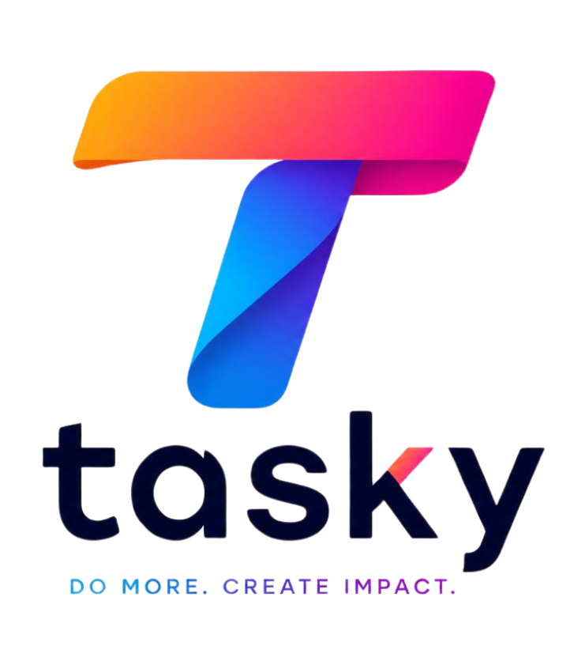

# tasky

<p align="center">
  
</p>

<p align="center">
  <strong>Project management with conversational AI task execution.</strong><br>
  Plan work, coordinate teams, and turn natural-language requests into action.
</p>

<p align="center">
  <a href="ROADMAP.md">Roadmap</a> ·
  <a href="SECURITY.md">Security</a> ·
  <a href="LICENSE">License</a>
</p>

## Overview

tasky is a self-hosted project management platform that combines structured project workflows with an in-app conversational AI assistant. Teams can manage work through familiar project views while using natural language to create, update, organize, and inspect tasks.

The application is designed to keep your project data under your control. It runs as a containerized application backed by PostgreSQL and Redis, and can connect to an AI provider or self-hosted model endpoint through the application settings.

## Features

- Conversational AI for project and task execution
- Kanban boards, task lists, sprints, dependencies, and time tracking
- Interactive Gantt charts with dependency visualization
- Calendar views for month, week, and day planning
- Dashboards with KPI metrics and team and task charts
- Drag-and-drop dashboard widgets
- CSV and Excel task export
- CSV and Excel bulk import
- Jira and Trello importers with field mapping
- OpenID Connect (OIDC) authentication
- Role-based access control and an administration dashboard
- File uploads with local storage or optional AWS S3 storage
- Background job processing with BullMQ and Redis
- Internationalization support

## Architecture

```text
Browser
	|
	+--> Next.js frontend (development: :3001)
	|
	+--> NestJS API (development: :3000, production: :3000)
				 |
				 +--> PostgreSQL 16  - application data
				 +--> Redis 7        - queues and background jobs
				 +--> Optional S3    - uploaded files
```

The production image contains the built frontend and backend and exposes a single application port. The development compose file runs the frontend and backend with the source tree mounted for live development.

## Requirements

- Docker Engine 24+ with Docker Compose v2
- At least 4 GB of memory available to Docker for a comfortable local setup
- Git, if cloning the repository

Node.js 22 is used by the development and production Dockerfiles. A local Node.js installation is only needed when running the frontend or backend outside Docker.

## Quick Start: Development

1. Clone the repository and enter the project directory:

	```bash
	git clone https://github.com/sfgco/tasky-ai.git
	cd tasky-ai
	```

2. Create a local environment file:

	```bash
	cp .env.example .env
	```

3. Replace the example authentication and encryption values with secure values:

	```bash
	openssl rand -base64 32
	openssl rand -base64 32
	openssl rand -hex 32
	```

	Use the generated values for `JWT_SECRET`, `JWT_REFRESH_SECRET`, and `ENCRYPTION_KEY` in `.env`.

4. Start the development stack:

	```bash
	docker compose -f docker-compose.dev.yml up --build
	```

5. Open the application at [http://localhost:3001](http://localhost:3001). The API is available at [http://localhost:3000](http://localhost:3000), and the health endpoint is [http://localhost:3000/api/health](http://localhost:3000/api/health).

The development stack starts PostgreSQL and Redis first, generates the Prisma client, applies migrations, seeds the database, and then starts the frontend and backend services.

### Development Commands

```bash
# Follow application logs
docker compose -f docker-compose.dev.yml logs -f app

# Stop the development stack and keep database volumes
docker compose -f docker-compose.dev.yml down

# Stop the stack and delete all local database, Redis, and upload data
docker compose -f docker-compose.dev.yml down -v
```

## Production Deployment

The production compose file builds the optimized image and exposes the application on port `3000`.

1. Create and edit the environment file:

	```bash
	cp .env.example .env
	```

2. Set strong, unique values for at least these variables:

	```dotenv
	JWT_SECRET=replace-with-a-long-random-value
	JWT_REFRESH_SECRET=replace-with-a-different-long-random-value
	ENCRYPTION_KEY=replace-with-a-64-character-hex-value
	```

3. Build and start the production stack:

	```bash
	docker compose --env-file .env -f docker-compose.prod.yml up -d --build
	```

4. Check the service and view logs:

	```bash
	docker compose --env-file .env -f docker-compose.prod.yml ps
	docker compose --env-file .env -f docker-compose.prod.yml logs -f app
	```

5. Open [http://localhost:3000](http://localhost:3000).

For a public deployment, put the application behind HTTPS and a reverse proxy, set `FRONTEND_URL` and `CORS_ORIGIN` to the public origin, and use managed or separately secured PostgreSQL and Redis services where appropriate.

## Configuration

`.env.example` contains the complete configuration reference. The most important settings are:

| Variable | Purpose | Default |
| --- | --- | --- |
| `DATABASE_URL` | PostgreSQL connection string | Local PostgreSQL URL |
| `REDIS_HOST` / `REDIS_PORT` | Redis connection | `localhost` / `6379` |
| `JWT_SECRET` | Access-token signing secret | Required for production |
| `JWT_REFRESH_SECRET` | Refresh-token signing secret | Required for production |
| `ENCRYPTION_KEY` | Encryption key for sensitive values | Required for production |
| `FRONTEND_URL` | Frontend origin used by the backend | `http://localhost:3001` |
| `CORS_ORIGIN` | Allowed browser origin | `http://localhost:3001` |
| `NEXT_PUBLIC_API_BASE_URL` | API URL used by the frontend | `http://localhost:3000/api` |
| `UPLOAD_DEST` | Local upload directory | `./uploads` |
| `MAX_FILE_SIZE` | Maximum upload size in bytes | `10485760` |
| `SMTP_HOST` / `SMTP_PORT` | Outbound email server | Optional |
| `AWS_*` | Optional S3-compatible file storage | Optional |
| `AI_ALLOWED_HOSTS` | Allowed AI endpoint hostnames | Any public host |
| `AI_ALLOW_PRIVATE_ENDPOINTS` | Allow private-network AI endpoints | `false` |

When using Docker Compose, the compose files override `DATABASE_URL` and `REDIS_HOST` with the internal service names `postgres` and `redis`. Keep the Docker-specific values in the compose files and use `.env` for secrets and deployment-specific settings.

## Repository Layout

```text
backend/             NestJS API, Prisma schema, migrations, and tests
frontend/            Next.js application and end-to-end tests
assets/logo/         Project branding assets
docker/              Container entrypoints and Docker notes
scripts/             Build and packaging scripts
Dockerfile.dev       Development image
Dockerfile.prod      Multi-stage production image
docker-compose.dev.yml   Development services
docker-compose.prod.yml  Production build and services
.env.example         Environment variable reference
ROADMAP.md           Planned and completed work
SECURITY.md          Vulnerability reporting and security guidance
```

## Testing and Quality Checks

Run checks inside the relevant package after dependencies are installed:

```bash
# Backend
cd backend
npm run lint:check
npm test
npm run test:e2e

# Frontend
cd ../frontend
npm run lint
npm run test:e2e
```

The Docker development workflow is the recommended way to run the complete application because it supplies PostgreSQL, Redis, and the expected service networking.

## Troubleshooting

### Ports are already in use

Stop the process using ports `3000`, `3001`, or `5435`, or change the published ports in `docker-compose.dev.yml`. The internal application ports should remain unchanged.

### The application cannot connect to PostgreSQL or Redis

Check service health and logs:

```bash
docker compose -f docker-compose.dev.yml ps
docker compose -f docker-compose.dev.yml logs postgres redis app
```

When running outside Docker, set `DATABASE_URL` and `REDIS_HOST` to addresses reachable from the host machine. When running inside Compose, use the service names `postgres` and `redis`.

### Configuration changes are not picked up

Restart the stack after changing `.env`:

```bash
docker compose -f docker-compose.dev.yml down
docker compose -f docker-compose.dev.yml up --build
```

## Security

Never commit `.env`, production credentials, or generated secrets. Use unique secrets for every environment, enable Redis authentication in production, use HTTPS, restrict CORS to the real frontend origin, and review the AI endpoint allowlist before enabling private-network access.

Please report vulnerabilities privately using the process in [SECURITY.md](SECURITY.md), rather than opening a public issue.

## Roadmap

See [ROADMAP.md](ROADMAP.md) for planned work across authentication, analytics, imports and exports, AI capabilities, and team collaboration.

## License

tasky is distributed under the license described in [LICENSE](LICENSE).
